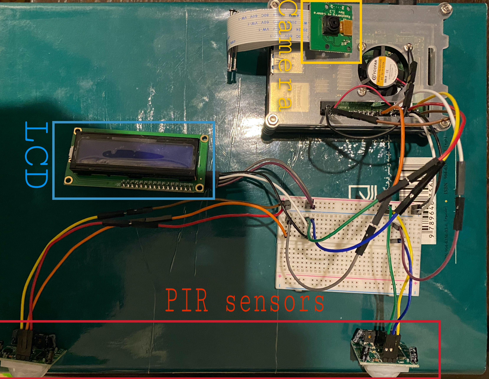
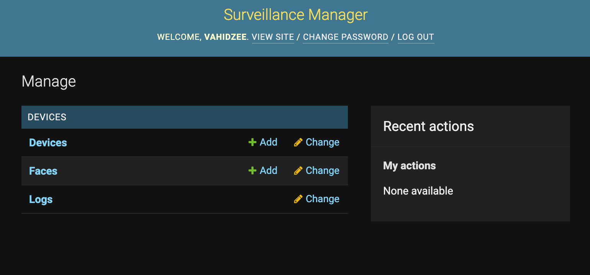

# Raspberry PI Smart Face-detector Surveillance System

This repository is a complete implementation for a Raspberry Pi-based cluster of surveillance cameras capable of performing on-device face detection and syncing with a customizable central management system. This project was proposed and presented as a part of my Spring 2021's Hardware Laboratory Course at Sharif University of Technology.

The central system is also able to process and distinguish faces in logged images from the pi nodes. It automatically creates a database of known face representations for each user and tracks their temporal and spatial activities. The whole data processing pipeline is designed to minimize the on-edge computations and resource requirements. Therefore the pi nodes only maintain a sporadically updated list of known face representations and communicate identification logs in a secured channel with the central management system to minimize communication and storage requirements.

**Requirements**: The central system consists of a management server and an administration portal. Both are implemented in a single fully documented Django3 application (available in the `server` directory), ready to be deployed along with the desired SQL database on a primary Ubuntu machine (with at least two processing cores and 2GBs of RAM). PI units are expected to have a working [Camera module](https://projects.raspberrypi.org/en/projects/getting-started-with-picamera) and two [PIR motion sensors](https://medium.com/geekculture/detecting-motions-using-pir-motion-sensor-with-raspberry-pi-98f88f9d5ffe) to detect entrance or exit events and optionally an [16x2 LCD display module](https://tutorials-raspberrypi.com/raspberry-pi-lcd-display-16x2-characters-display-hd44780/) to show greetings and news as mounted on top of a desired property's gateway to surveil. PI's logic is also fully documented and available inside the `pi` directory.

**Workflow**: The whole working mechanism of this system is a simple async IOT cluster implementation. When a person walks by each PI unit, it detects movement and looks for a familiar face representation inside of its copy of the known faces database to acquire its respective FaceID (or uploads the image and asks the central system for one). With a valid FaceID at hand, an appropriate enter or exit event is logged back to the main system. To ensure proper security and simulate an off-the-shelf products' functionality, Communications are initiated using a custom hand-shake method, and the ownership of PI units is registered using unique device IDs upon first device setup.

**Administration and Notification System**: The central system separates devices of different users and lets them add or remove known faces and track their activities logged by each of their surveillance IOT sensors. It also sends emails whenever a new event has occurred, making it a simple implementation for a PI-based home security system.

## Farsi Documentations
Report files and explanatory documentations in Latex can be accessed from:
* [Project Proposal](https://github.com/vahidzee/pi-surveillance/blob/main/files/proposal.pdf)
* [Phase 1 Report](https://github.com/vahidzee/pi-surveillance/blob/main/files/phase_1.pdf)
* [Phase 2 & 3 Report](https://github.com/vahidzee/pi-surveillance/blob/main/files/phase_2&3.pdf)

## LICENSE
MIT license, see [LISENCE](https://github.com/vahidzee/pi-surveillance/blob/main/LICENSE).
